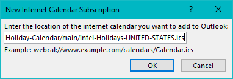
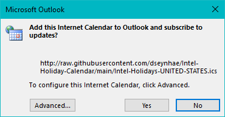
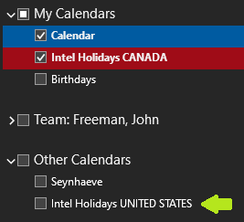
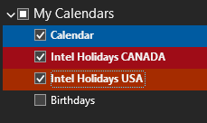

# Intel Holiday Calendar

👉 Synchronized web calendars with Intel Holidays for various regions.

## Get the Web Calendar URL

1. Go to the <https://github.com/dseynhae/Intel-Holiday-Calendar> repository.
2. Select the desired web calendar file (e.g. `Intel-Holidays-UNITED-STEST.ics`).
3. In the file content header, click on the `Raw` button.
4. This will display the raw content of the web calendar, and reveal the URL:

   ```url
   https://raw.githubusercontent.com/dseynhae/Intel-Holiday-Calendar/main/Intel-Holidays-UNITED-STATES.ics
   ```

5. Replace the `https` protocol by the `webcal` protocol in this URL:

   ```url
   webcal://raw.githubusercontent.com/dseynhae/Intel-Holiday-Calendar/main/Intel-Holidays-UNITED-STATES.ics
   ```

   ⚠️ A web calendar needs to be accessible from a public URL.

   * The source URL for the calendars won't work:

      ```url
      https://phonebook.fm.intel.com/ww/ics/Intel-Holidays-UNITED%20STATES.ics
      ```

      Therefore, the different region calendars are copied from this internal location, to the WAN-accessible URL in GitHub.

   * This will NOT work when using a 1Source Sandbox repository (the URL is still internal)!

## Subscribe Outlook to the Web Calendar

1. Open Outlook, navigate to the Calendar, select the `Home` tab.
2. In the Ribbon, select the `Add>From internet...` command.
3. In the popup, enter the web calendar URL, and hit OK.

   

4. In the popup confirm the subscription to updates with the `Yes` button:

   

5. Exit  Outlook: `File>Exit`.
6. Restart Outlook and navigate to the Calendar; The Web Calendar is available under `Other Calendars`:

   

7. You can now manage the item:

   * Move to a different group
   * Enable/disable
   * Change the name and color
   * ...

   

---

This repository holds all the components to make automatic synchronization with the source URL happen.
